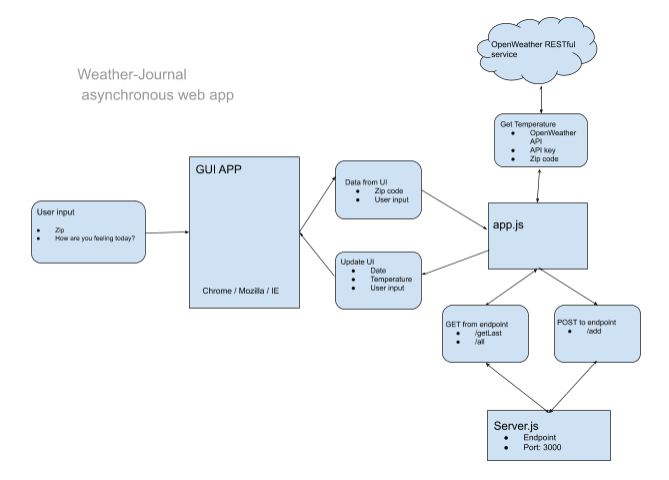

# Weather-Journal App Project

## Overview

This project implements an asynchronous web app that uses Web API and user data to dynamically update the UI.

The UI will be update with the followig information:

1. Date: Obtained locally from the system running the application.

2. Temperature: Obtained using [OpenWeather](https://openweathermap.org/api)  REST Web API.
    * An API key is needed to successfuly calling the weather service.

3. A message enter by the user which it is retrieved using JS DOM selectors.



    

## Dependencies

1. [Node JS](https://nodejs.org/en/) Visit the project website to obtain instructions on how to install the package depending on your OS.

2. Express

```
$ npm install express
```

3. Cors

```
$ npm install cors
```

4. Body parser

```
$ npm install body-parser
```

## Routes and Ports

* Express listening port: 3000

* Routes:

  * GET Route I: Server Side: /all

  * GET Route II: Client Side: /getLast

  * POST Route: /add

## Instructions

1. Navigate to the root of the projectand start server.js.

```
$ node server.js
```

2. Enter a zip code under: `Enter Zipcode here` text box.
    Note: only US zip codes are correctly mapped to a location now.

3. Enter message to dynamically update the UI under: `How are you feeling today` text box.

4. Press `Generate` button. 

5. `Most Recent Entry` placeholder will be updated with Date, Temperature, and 