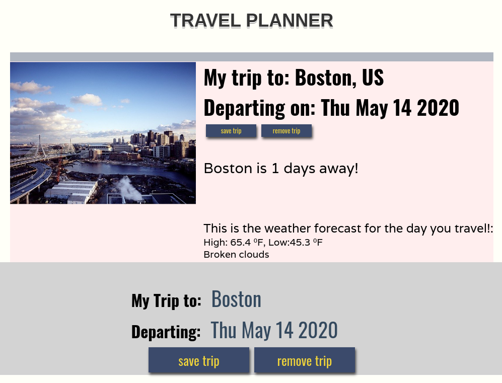

# FEND Capstone - Travel App

## Overview

This project implements an asynchronous web app in combination with 3 RestFul APIs:

1. [GeoNames](http://www.geonames.org/export/web-services.html) to convert a City name to lat and long coordinates.

2. [Weatherbit.io](https://www.weatherbit.io/) to obatin weather history or forecast using the lat and lon coordinates of the place to travel.

3. [Pixabay](https://pixabay.com/api/docs/) to obtain an image representing to the best extend, the place to travel.

Some of the components used in this application are:

* Webpack: Creating a production and a development mode environment.
* Loaders: Babel, and sass.
* Plugins: html-webpack-plugin, CleanWebpackPlugin, and service workers.
* Jest - Testing of the javascript methods used to perform string validation and communication between the NLP API and the Application GUI.

## Prereqs

1. Obtain a GeoNames API [username](http://www.geonames.org/login).

2. Obtain a Weatherbit [API key](https://www.weatherbit.io/account/create).

3. Obatin a Pixabay [API key](https://pixabay.com/accounts/register/?source=main_nav_join).


## Instructions

1. Clone the repo

```
$ git clone https://github.com/saduf/capstone-travel-app.git
```

2. Navigate to the project root.
```
$ cd capstone-travel-app
```

3. Install dependencies
```
$ npm install
```

4. Crete a .env file with Aylien API key.
```
$ vi .env

# Paste the following lines and update your API_ID and API_KEY with yours:
GEOMAP_API=xxxxxxxxxx
WBIT_API=xxxxxxxxxx
PIXABAY_API=xxxxxxxxxx
```

5. In other terminal build prod env.
```
$ npm run build-prod
```

6. Start express server
```
$ cd src/server
$ npm start
```

7. Build dev env.
```
cd $PROJECT_ROOT
$ npm run build-dev
```

8. Run jest test in other terminal
```
$ npm run test
```

You should see al tests pass.

9. Dev environment GUI will be available at localhost:8080  
If you are prompted to grant access to your location, the application displays a picture and the weather of your location. If the location access is not granted, the app displays a default image and weather location of somewhere in Hawaii in the welcome screen.

Enter a information in the input fields, and press save trip large button to GET results from the server. Once the results are back the screen will update with the weather forecast, an image, and other information related to the city and date of travel.



10. Prod env will be available at localhost:8081  
You can access Dev and Prod GUI at the same time as they are listening on different ports.

11. Kill the server, you can interrupt the terminal where it's runnin Ctrl+c.  
Refressh the production app at localhost:8081.  
Application is displayed as part of be using service workers.
